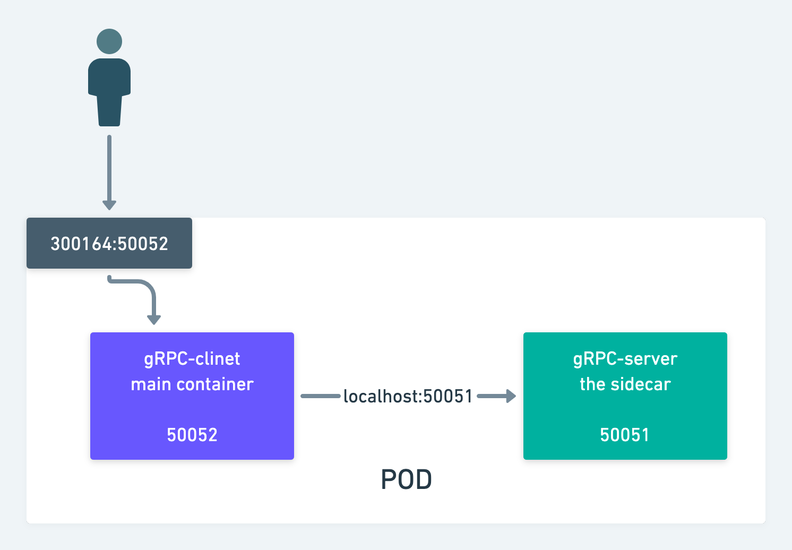

# Deploy a sidecar in Kubernetes
This project demonstrate the deployment of a sidecar in Kubernetes.
A main container and a sidecar is deployed together in one pod. The pod
with the 2 containers work as one unit.



# Requirements
- docker
- [minikube](https://minikube.sigs.k8s.io/docs/start/)
- [kubectl](https://kubernetes.io/docs/tasks/tools/)

# How to use this repo?
- Clone this repo
- Run `./gen_go_lib.sh`. It will generate the necessary go code from the
proto file and install the dependencies
- Run `./build_images.sh`. It will build the client and server image and publish it in `minikube`.
So that minikube can resolve the image from locally.
- Run `./deploy.sh`. It will create a deployment and a service in `minikube`
- To get the service url and port, run 
```
minikube service sidecar-deployment-service --url
```
The name `sidecar-deployment-service` is defined in `k8s/deployment.yml` file.
- Use the `url` and `port` from [Postman](https://www.postman.com/downloads/)
or [gRPC-cli](https://github.com/grpc/grpc/blob/master/doc/command_line_tool.md)
to talk to the client
- After having fun, you can kill the deployment by
```
kubectl delete deployments sidecar-deployment
```
The name 
`sidecar-deployment` is defined in `k8s/deployment.yml` file.